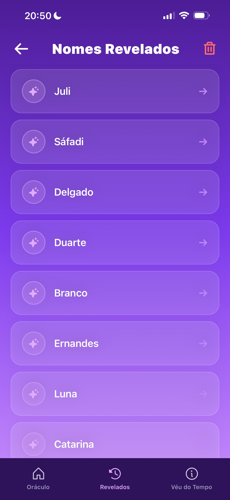
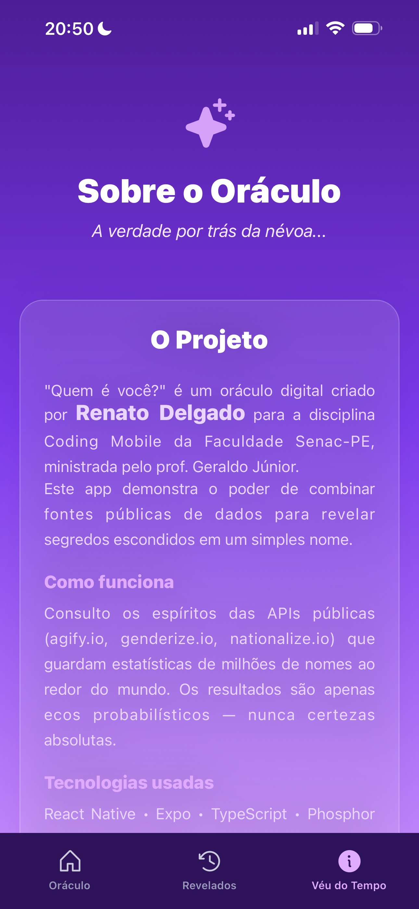

# Quem é você?

> Um oráculo digital que estima idade, gênero e possíveis países de origem a partir de um nome.

Aplicativo criado por Renato Delgado como projeto para a disciplina *Coding Mobile* (FacSenac-PE). O app demonstra integração com APIs públicas, animações, armazenamento local e fluxo de navegação em abas usando `expo-router`.

---

**Principais objetivos**
- **Didático:** mostrar integração de serviços externos (APIs) em um app móvel com React Native + Expo.
- **Prático:** interface animada e experiência de usuário refinada (Moti, gradientes, ícones).
- **Privacidade:** histórico e cache salvos apenas localmente via `AsyncStorage`.

**Tecnologias**
- **React Native** + **Expo** (gerenciamento e builds)
- **TypeScript**
- **expo-router** (navegação de tabs)
- **Moti** (animações)
- **phosphor-react-native** (ícones)
- **expo-linear-gradient** (gradientes)
- **@react-native-async-storage/async-storage** (cache e histórico)
- **EAS** (opcional — builds na nuvem)

---

# Estrutura do Projeto
```
root/
 ├── app/
 │   ├── (tabs) 
 |   |   ├──_layout.tsx
 |   |   ├──historico.tsx
 |   |   └──index.tsx
 │   └── _layout_.tsx
 └── services/
     └── getNameInfo.ts
```
---

# Preview do App

### Home


### Home com resultados


### Histórico de Pesquisas


### Sobre o App


---

## Como Rodar o Projeto

### 1. Instale as dependências globais:
```bash
npm install --global expo-cli
```

### 2. Instale as dependências do projeto:
```bash
npm install
```

### 3. Execute o app:
```bash
npx expo start
```

Use o **Expo Go** no celular ou um emulador Android/iOS para visualizar.

---

## Contato
- Autor: Renato Delgado
- Email: renato.delgado@edu.pe.senac.br / rena7o.delgado@gmail.com
